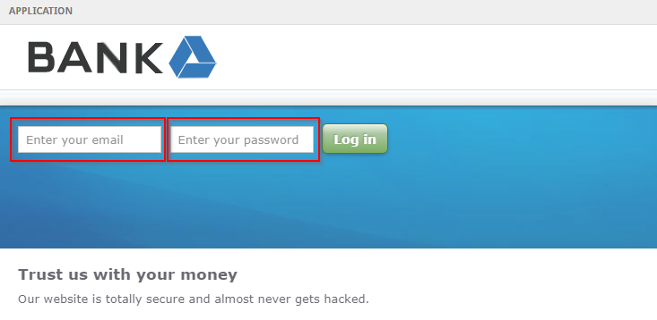
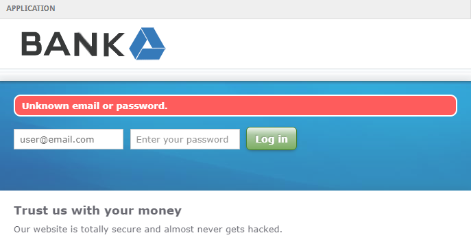
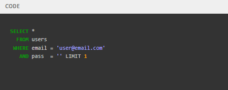
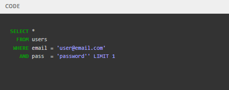
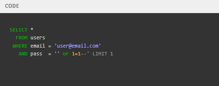
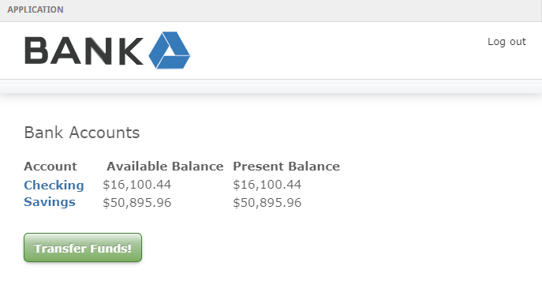

# First Steps

This is the vulnerable application we will be trying to hack with a <mark style="color:red;">**SQL INJECTION**</mark> attack.

<figure><figcaption></figcaption></figure>

Here are the application logs. Watch what happens here when you interact with the vulnerable application.

<figure><figcaption></figcaption></figure>

Go ahead and try logging in with the following credentials:\
&#x20;\- Email: `user@email.com`\
&#x20;\- Password: `password`

<figure><figcaption></figcaption></figure>

<figure><figcaption></figcaption></figure>

Okay, so guessing the password didn't work. Let's try adding a quote character after the password:\
&#x20;\- Email: `user@email.com`\
&#x20;\- Password: `password'`

<figure><figcaption></figcaption></figure>

Hmmm. The application crashed with an unexpected error. What could that mean?

<figure><figcaption></figcaption></figure>

The logs show a SQL syntax error. This indicates that the quote character messed something up in an unexpected way.

This is what the application code looks like behind the scenes.



<figure><figcaption></figcaption></figure>



<figure><figcaption></figcaption></figure>



<figure><figcaption></figcaption></figure>



Enter the password `password'` and watch the code window.

The quote is inserted directly into the SQL string and terminates the query early. this is what caused the syntax error we saw in the logs.

This behavior indicates that the application might be vulnerable to <mark style="color:red;">SQL INJECTION</mark>.

Enter the following credentials and click "Log in":\
&#x20;\- Email: `user@email.com`\
&#x20;\- Password: `' or 1=1--`

<figure><figcaption></figcaption></figure>

And we are in! We successfully gained acces to the application without having to guess the password using <mark style="color:red;">SQL INJECTION</mark>.

<figure><figcaption></figcaption></figure>

The -- characters you entered caused the database to ignote the rest of the SQL statement, allowing you to be authenticated without having to supply thre real password.

<figure><figcaption></figcaption></figure>


Phew. Now we know how <mark style="color:red;">SQL INJECTION</mark> works, let's learn how to protect against this kind of attack.

