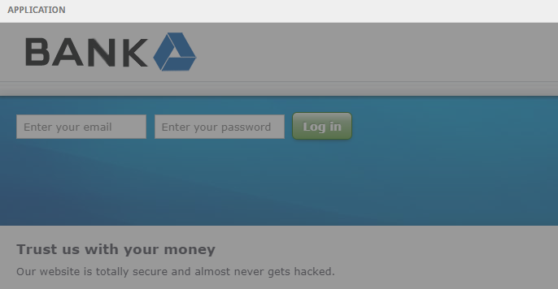

# 💡 What we do

This is the vulnerable application we will be trying to hack with a <mark style="color:red;">**SQL INJECTION**</mark> attack.

<figure><figcaption></figcaption></figure>

Here are the application logs. Watch what happens here when you interact with the vulnerable application.

<figure><figcaption></figcaption></figure>

Go ahead and try logging in with the following credentials:\
&#x20;\- Email: `user@email.com`\
&#x20;\- Password: `password`

``
